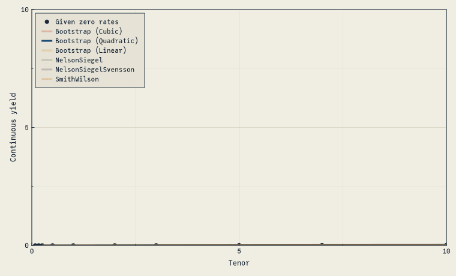

```{julia}
#| echo: false
#| output: false
using Pkg
Pkg.activate(".")
Pkg.resolve()
Pkg.instantiate()
```

Given rates and maturities, we can fit the yield curves with different techniques.

Below, we specify that the rates should be interpreted as `Continuous`ly compounded zero rates:

```{julia}
using FinanceModels
using CairoMakie

include(joinpath(@__DIR__, "..", "..", "assets", "themes", "cassette_futurism.jl"))
set_theme!(cassette_futurism_theme())
```

```{julia}
rates = Continuous.([0.01, 0.01, 0.03, 0.05, 0.07, 0.16, 0.35, 0.92, 1.40, 1.74, 2.31, 2.41] ./ 100)
mats = [1 / 12, 2 / 12, 3 / 12, 6 / 12, 1, 2, 3, 5, 7, 10, 20, 30]
```

The above rates and associated maturities represent prices of zero coupon bonds, which we use as the financial instrument that we will fit the curve to:

```{julia}
quotes = ZCBYield.(rates, mats)
```

Fitting is then calling `fit` along with the desired curve construction technique. Here are several variants:

```{julia}
ns = fit(Yield.NelsonSiegel(), quotes);
nss = fit(Yield.NelsonSiegelSvensson(), quotes);
sw = fit(Yield.SmithWilson(ufr=0.05, α=0.1), quotes);
bl = fit(Spline.Linear(), quotes, Fit.Bootstrap());
bq = fit(Spline.Quadratic(), quotes, Fit.Bootstrap());
bc = fit(Spline.Cubic(), quotes, Fit.Bootstrap());
```

That's it! We've fit the rates using six different techniques. These can now be used in a variety of ways, such as calculating the `present_value`, `duration`, or `convexity` of different cashflows if you imported [ActuaryUtilities.jl](https://github.com/JuliaActuary/ActuaryUtilities.jl)"

## Visualizing the results

```{julia}
const CURVES = [
    (bc,  "Bootstrap (Cubic)"),
    (bq,  "Bootstrap (Quadratic)"),
    (bl,  "Bootstrap (Linear)"),
    (ns,  "NelsonSiegel"),
    (nss, "NelsonSiegelSvensson"),
    (sw,  "SmithWilson"),
]

function curveplot!(ax, curve, color; label="", alpha=1.0)
    maturities = 0.25:0.25:40
    f(x) = rate(zero(curve, x))
    lines!(ax, maturities, f.(maturities);
        label, linewidth=3, color=(color, alpha))
end

function build_axis!(ax, alpha=ones(length(CURVES)))
    scatter!(ax, mats, rate.(Continuous().(rates));
        label="Given zero rates", color=CF_INK, markersize=9)
    for (i, (c, name)) in enumerate(CURVES)
        curveplot!(ax, c, CASSETTE_PALETTE[i]; label=name, alpha=alpha[i])
    end
    return ax
end

let
    fig = Figure(size=(760, 460))
    ax = Axis(fig[1,1]; xlabel="Tenor", ylabel="Continuous yield")
    build_axis!(ax)
    axislegend(ax, position=:lt)
    fig
end
```

And an animated version that fades each fit in turn:

```{julia}
#| output: false
let
    fig = Figure(size=(760, 460))
    ax = Axis(fig[1,1]; xlabel="Tenor", ylabel="Continuous yield")
    a = [1.0, 0.25, 0.25, 0.25, 0.25, 0.25]
    record(fig, "anim_fps2.gif", 1:6; framerate=2) do _
        a .= circshift(a, 1)
        empty!(ax)
        build_axis!(ax, a)
        axislegend(ax, position=:lt)
    end
end
```

