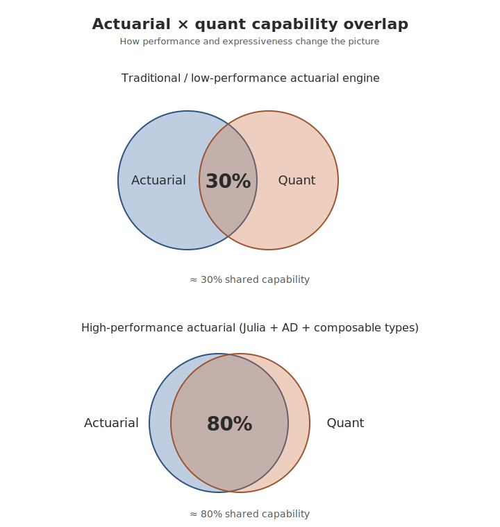

```{julia}
#| echo: false
#| output: false
using Pkg
Pkg.activate(".")
Pkg.instantiate()
```

One question that I try to explain sometimes is the purpose of actuarial modeling and financial projections in the actuarial context. It genuinely is different than the "quant" perspective where valuations of individual assets is of the utmost importance. In contrast, in actuarial projections, financial reporting, internal forecasting, capital management, and other non-trading-desk activities typically trade precision for comprehensiveness and completeness. A massive portfolio of 100,000 annuity contracts supported by ~1,000 assets doesn't need to be valued to the last cent, but doing a multi-basis forecast still requires accuracy and robustness. For this reason, actuarial models and trading portfolio models share many aspects but they do differ in design trade-offs to achieve different goals.

{fig-align="center" width="70%"}


## Example: Fixed Bond Analytics.

Most bond analytics is a cashflow vector and a yield curve. Price, duration, convexity, key-rate durations, sensitivity to a calibrated curve, arbitrary-precision validation — all of those are things you *decide* to compute from those two inputs. The interesting design question is how much code each decision costs, and how much new machinery each new computation requires.

For the workflows it covers, [JuliaActuary](https://juliaactuary.org)'s answer is: not much, and almost none. A small vocabulary of primitives — `pv`, `duration`, `convexity`, `sensitivities`, the curve constructors. These compose together to provide a very generic and efficient set of tools to analyze asset and liabilities. Generic numeric types flow through them; `ForwardDiff` walks whatever derivative you need out of the same code. The cashflow vector built once at the top of this post threads through every example below.

[QuantLib](https://www.quantlib.org/) appears throughout as a reference — the *de facto* open-source standard for quantitative finance, 25 years old, the implementation most other libraries get cross-checked against. The two libraries also have noticeably different design centers. QuantLib aims for *trading-desks*: settlement conventions, holiday calendars, market-specific pricing engines — the machinery you need when a counterparty is going to send you a cash transfer next Tuesday and the answer has to match the exact figure their bond admin system prints. JuliaActuary is *projection-flavored*: cashflows and curves as composable values, generic numeric types so that sensitivities and stochastic shocks flow through naturally, calibration as ordinary optimization. There is quite a bit of overlap in capabilities and quite a bit of Quantlib's surface area can be accurately recrated using Julia and JuliaActuary's functionality.

## The cashflow vector

A 5-year, 4% semi-annual-coupon bond at a flat 3% continuously-compounded yield. Once the vector exists, price and duration are one function call each.

```{julia}
using FinanceCore
using FinanceCore: Continuous, Periodic
using FinanceModels
using FinanceModels: Spline
using ActuaryUtilities
using Printf

coupon_rate = 0.04
maturity_years = 5
freq_per_year = 2
par = 100.0

# A simple upward-sloping zero curve. The t = 0 anchor lines up with QL's
# ZeroCurve boundary so both libraries are pricing against an identical grid.
tenors = [0.0, 1.0, 2.0, 3.0, 4.0, 5.0, 7.0]
base_zeros = [0.025, 0.025, 0.027, 0.029, 0.030, 0.032, 0.034]
curve = FinanceModels.ZeroRateCurve(base_zeros, tenors, Spline.Linear())

bond = FinanceModels.Bond.Fixed(coupon_rate, Periodic(freq_per_year), maturity_years)
cfs = collect(bond)

price = FinanceCore.pv(curve, cfs) * par
mod_dur = duration(Modified(), curve, cfs)

(price=price, modified=mod_dur)
```

QuantLib's setup is longer — a `Schedule`, a `FixedRateBond`, a `FlatForward` curve, a `DiscountingBondEngine`, a `setPricingEngine` call — but it produces the same number:

```python
# Python — QuantLib via SWIG bindings
import QuantLib as ql

settle    = ql.Date(1, 1, 2026)
maturity  = ql.Date(1, 1, 2031)
day_count = ql.Thirty360(ql.Thirty360.BondBasis)

schedule = ql.Schedule(settle, maturity, ql.Period(ql.Semiannual),
                       ql.NullCalendar(), ql.Unadjusted, ql.Unadjusted,
                       ql.DateGeneration.Backward, False)
bond     = ql.FixedRateBond(0, 100.0, schedule, [0.04], day_count)

pillar_dates = [settle + ql.Period(y, ql.Years) for y in [0, 1, 2, 3, 4, 5, 7]]
zeros        = [0.025, 0.025, 0.027, 0.029, 0.030, 0.032, 0.034]
curve = ql.ZeroCurve(pillar_dates, zeros, day_count, ql.NullCalendar(),
                     ql.Linear(), ql.Continuous)
bond.setPricingEngine(ql.DiscountingBondEngine(ql.YieldTermStructureHandle(curve)))

print(bond.NPV())  # → 103.6781792217
```

| metric            | FinanceModels / ActuaryUtilities | QuantLib (Python) | diff |
|-------------------|----------------------------------|-------------------|------|
| Price             | 103.6781792217                   | 103.6781792217    | 0.00 |
| Modified duration | 4.5873235505                     | 4.5873235505      | 0.00 |

The interesting part is what the same `cfs` is about to do without writing any new code.

## Modified duration is the derivative

Modified duration is, definitionally, a derivative: `−d(log P)/dy`. In FinanceModels, that's exactly what's written down:

```julia
function duration(yield, valuation_function)
    D(i) = log(valuation_function(i + yield))
    return -ForwardDiff.derivative(D, 0.0)
end
```

That's the whole function. No shift size, no central-difference formula, no special-casing the compounding convention — `ForwardDiff.derivative` walks the analytic derivative through whatever sequence of operations `pv` performed, and out comes the exact gradient.

The contrast with bump-and-reprice is visible if you ask the same question both ways:

```{julia}
mod_ad = duration(Modified(), curve, cfs)

# Parallel-shift the term-structured curve by `shift` at every pillar.
function mod_finite_diff(shift)
    yield_up = FinanceModels.ZeroRateCurve(base_zeros .+ shift, tenors, Spline.Linear())
    yield_dn = FinanceModels.ZeroRateCurve(base_zeros .- shift, tenors, Spline.Linear())
    p_up = FinanceCore.pv(yield_up, cfs)
    p_dn = FinanceCore.pv(yield_dn, cfs)
    p = FinanceCore.pv(curve, cfs)
    return (p_dn - p_up) / (2 * shift * p)
end

for h in (1e-2, 1e-4, 1e-6, 1e-8, 1e-10, 1e-12, 1e-14)
    fd = mod_finite_diff(h)
    err = abs(fd - mod_ad)
    @printf("shift = %.0e   mod (FD) = %.12f   |err vs AD| = %.2e\n", h, fd, err)
end
@printf("                   mod (AD) = %.12f\n", mod_ad)
```

For shifts in the 1e-4 to 1e-6 range, the finite-difference answer agrees with AD to six or seven figures — fine for most reporting. Push the shift down further and floating-point cancellation takes over: at 1e-12 the FD answer is *less* accurate than at 1e-4. There is no shift size that recovers the AD answer.

Six-figure agreement is enough for the standard duration report you ship to a quarterly committee, so AD's accuracy on this number is overkill. The bigger win shows up in pipelines that compose multiple derivatives — calibration objectives, optimization gradients, hedge ratios, Greeks for non-Black-Scholes payoffs — all from the same `ForwardDiff.derivative` call applied to the price function, with no shift-size choice propagating up the chain.

## Convexity is the next derivative

Convexity is `(d²P/dy²) / P`. QL's `BondFunctions.convexity` takes a *scalar* `InterestRate`, not a yield curve, so for this convention comparison both sides drop down to a flat 3% reference yield. Same bond, same cashflow vector — only the discounting model is flat instead of term-structured:

```{julia}
yield_flat = FinanceModels.Yield.Constant(Continuous(0.03))
convex = convexity(yield_flat, cfs)
```

QuantLib has a native `BondFunctions.convexity`:

```python
# Python — QuantLib
y_ann = math.exp(0.03) - 1                  # annual-effective equiv. of 3% cont.
ir    = ql.InterestRate(y_ann, day_count, ql.Compounded, ql.Annual)
convex_quantlib = ql.BondFunctions.convexity(bond, ir)   # → 25.2585956899
```

They report different numbers — exactly `(1+y)²` apart — because they use different conventions:

| metric                                         |    value    |
|------------------------------------------------|------------:|
| `ActuaryUtilities.convexity`     ("Macaulay")  |  26.8205000 |
| `QuantLib.BondFunctions.convexity` ("modified")|  25.2585957 |
| QL × `(1 + y_ann)²`                            |  26.8205000 |

QuantLib normalizes by `(1+y)²` — the extra chain-rule factor that drops out when you differentiate against the *periodic* yield. That's "modified convexity" in the discrete-compounding sense. ActuaryUtilities reports the unnormalized second moment of cashflow times — the convexity that Bloomberg and most actuarial references show. Neither is wrong; both show up in industry. The conversion is a single multiplication.

::: {.callout-note collapse="true"}
## Under the hood: how `convexity` works (and how to write your own convention)

`convexity(yield, cfs)` is internally a nested pair of `ForwardDiff.derivative` calls. Roughly:

```julia
function convexity(yield, cfs)
    v(x) = abs(price(yield + x, cfs))
    ∂²P  = ForwardDiff.derivative(y -> ForwardDiff.derivative(v, y), 0.0)
    return ∂²P / v(0.0)
end
```

The shock convention is set by how `yield + Δ` is defined for the yield type. For `Yield.Constant{Continuous}`, `+` uses `log1p` semantics so `Δ` is interpreted as a *periodic*-rate shock — which gives Macaulay-style `t·(t+1)` convexity. For a continuous-rate convexity instead, write the AD call directly against your own parameterization:

```{julia}
using ForwardDiff

function price_at_continuous(y)
    yc = FinanceModels.Yield.Constant(Continuous(y))
    return FinanceCore.pv(yc, cfs)
end

ytm_flat = 0.03
P0 = price_at_continuous(ytm_flat)
convex_cont = ForwardDiff.derivative(
    y -> ForwardDiff.derivative(price_at_continuous, y), ytm_flat) / P0
```

This gives the continuous-shock convexity (`Σ t²·cf·df / P`), which differs from the library's `convexity` by exactly one Modified duration:

```{julia}
mod_flat = duration(Modified(), yield_flat, cfs)
(convex_cont, convex - convex_cont, mod_flat)
```

The same AD machinery extends to any derivative order or shock convention — write the parameterization, call `ForwardDiff.derivative` (or `.gradient`, or `.hessian`), nest as deep as you want.
:::

## Key-rate durations decompose the derivative

KRDs come from Thomas Ho's 1992 paper — *the* standard ALM sensitivity decomposition: shift the zero curve by a tent function centered at each key tenor, measure the price change, sum across pillars to recover the modified duration. ActuaryUtilities ships the tent bumper.

```{julia}
krd_pillars = collect(1.0:1.0:10.0)
krd = [duration(KeyRateZero(t), curve, cfs) for t in krd_pillars]

println("Pillar      KRD")
for (t, k) in zip(krd_pillars, krd)
    @printf("  %5.1fy   %12.8f\n", t, k)
end
@printf("\n  Σ KRD    = %12.8f\n", sum(krd))
@printf("  Modified = %12.8f\n", mod_dur)
```

A 5-year bond has no cashflows past year 5, so the long-end pillars are exactly zero — the right answer, not a bug. The 5y pillar dominates because the principal repayment sits there. And `Σ KRD ≈ Modified duration` to within the finite-difference noise of the 10 bp internal bump, which is the invariant Ho's construction is designed to satisfy.

QuantLib doesn't ship a tent bumper, but it's emulable: define a `ZeroCurve` with `Linear` interpolation across pillar dates, bump one pillar at a time, reprice. Pillar by pillar:

| pillar | AU (Ho tent) | QL (ZeroCurve bump) | diff      |
|-------:|-------------:|--------------------:|----------:|
|   1 y  |  0.04225406  |     0.03749135      | +4.76e-03 |
|   2 y  |  0.07295018  |     0.07295018      |  0.00     |
|   3 y  |  0.10597903  |     0.10597903      |  0.00     |
|   4 y  |  0.13663542  |     0.13663542      |  0.00     |
|   5 y  |  4.22952272  |     4.22952272      |  0.00     |
|  6–10y |  0           |     0               |  0        |
|  **Σ** |**4.58734142**|  **4.58257871**     | +4.76e-03 |

Interior pillars match to displayed precision; the discrepancy at pillar 1 is an edge-convention difference, not a numerical one. AU's Ho-1992 tents are *flat-left* at the first pillar and *flat-right* at the last, which extends coverage to `t = 0` and to `∞` and makes the tents *tile the timeline* at every interior point. Summing them gives exactly a parallel shift, so **by construction Σ KRD = Modified Duration** — to FD precision under the 10bp internal bump used here, and to machine precision via the AD-through-curve path in the next section. This is the *aggregation-preserving* convention. The standard market alternative — zero-anchored tents at the extreme pillars, which the QL emulation reproduces — instead leaves a gap on `[0, pillar_1)`: the bond's `t = 0.5` cashflow sees only half the pillar-1 bump, which shows up as the ~5bp understatement above. The two conventions answer slightly different questions, and the aggregation-preserving one is the right answer when you need asset-and-liability KRD vectors to sum cleanly into the portfolio-level duration.

(`KeyRatePar` is also available — same API, par-curve bump, same flat-left/flat-right edges.)

## The whole sensitivity bundle in one call

ActuaryUtilities' `sensitivities(zrc, cfs)` returns the value, the per-pillar modified-duration vector, *and* the per-pillar convexity matrix from a single second-order AD pass:

```{julia}
zero_rates = [0.02, 0.025, 0.028, 0.030, 0.032, 0.034]
tenors = [1.0, 2.0, 3.0, 5.0, 7.0, 10.0]
zrc = FinanceModels.ZeroRateCurve(zero_rates, tenors)

result = sensitivities(zrc, cfs)

@printf("price                  = %.6f\n", result.value * par)
println("durations by pillar    = ", round.(result.durations; digits=6))
@printf("Σ durations            = %.6f   (≈ total Modified duration)\n",
    sum(result.durations))
@printf("Σ convexities (matrix) = %.6f   (≈ total convexity)\n",
    sum(result.convexities))
```

Each entry of `result.durations` is the bond's sensitivity at that specific pillar — the same KRD vector from the previous section, recomputed by direct AD through the curve construction instead of by tent bumps. The full convexity *matrix* (6×6 here) gives cross-pillar second-order effects: `result.convexities[i, j]` is `∂²price / ∂z_i ∂z_j`. There is no "sensitivity mode" anywhere in the library; `ZeroRateCurve` and `pv` are ordinary functions that happen to be generic on numeric types, and `sensitivities` bundles the value, gradient, and Hessian.

The same Float64 code path runs in `BigFloat` for validation, `ForwardDiff.Dual` for nested AD, `Measurements.Measurement` for uncertainty propagation — any numeric type that implements arithmetic:

```{julia}
yield_big = FinanceModels.Yield.Constant(Continuous(big"0.03"))
cfs_big = collect(FinanceModels.Bond.Fixed(big"0.04", Periodic(2), 5))
duration(Modified(), yield_big, cfs_big)
```

With QuantLib the entire library is `double`; raising precision is a library fork.

The composability does have limits worth naming. `ForwardDiff` walks through whatever Julia code you write *as long as* the code stays in generic-numeric territory — Float64 type pins, in-place mutation, and FFI calls into non-Dual-aware solvers (some configurations of `Optim.LBFGS`, certain root-finders) break the chain. FinanceModels' own interfaces are written to be AD-friendly throughout; the caveats are about user code that reaches outside the library.

::: {.callout-note collapse="true"}
## Under the hood: writing your own AD pipeline

If `sensitivities` doesn't bundle exactly what you want — different curve type, different valuation function, mixed asset/liability portfolio — write the AD call directly:

```{julia}
function price_from_zeros(rates)
    curve = FinanceModels.ZeroRateCurve(rates, tenors)
    return FinanceCore.pv(curve, cfs) * par
end

ForwardDiff.gradient(price_from_zeros, zero_rates)
```

The same `ForwardDiff.Dual` mechanism, the same numbers as `result.durations * (-1) * value * par` (sign and scaling from how `sensitivities` normalizes). Wraps cleanly with `Optimization.jl` for calibration with an exact gradient, `Measurements.Measurement` for error bars, another `ForwardDiff.gradient` for the Hessian.
:::

## When the cashflows respond to rates

Everything so far assumed the cashflow vector was *fixed*. That's a fine assumption for a Treasury bond. It's the wrong assumption for everything actually interesting in an ALM book: callable bonds, prepayable mortgages, life-insurance liabilities with dynamic lapse behavior, GICs with surrender options. The policyholder or borrower has an option whose exercise correlates with rates, and the cashflows on the page are a *function* of the curve you're trying to price them against.

The simplest non-trivial case is a level-pay mortgage pool with a constant conditional prepayment rate (CPR). The pass-through cashflow generator is the standard factor model: the underlying mortgage amortizes on its original schedule, and each period a fraction `cpr` of the surviving balance prepays voluntarily on top of the scheduled cashflow.

```{julia}
using FinanceCore: Cashflow

function passthrough_cfs(wac, balance, term, cpr)
    payment = balance * wac / (1 - (1 + wac)^(-term))
    sched_bal = balance
    factor = one(cpr)
    map(1:term) do t
        sched_int = sched_bal * wac
        sched_prin = payment - sched_int
        sched_bal_end = sched_bal - sched_prin
        cf = factor * payment + factor * cpr * sched_bal_end
        factor *= one(cpr) - cpr
        sched_bal = sched_bal_end
        Cashflow(cf, Float64(t))
    end
end

wac_m, term_m, bal_m = 0.05, 10, 100.0
y_market = 0.04
yj_market = FinanceModels.Yield.Constant(Continuous(y_market))

cfs_static = passthrough_cfs(wac_m, bal_m, term_m, 0.06)
(price=FinanceCore.pv(yj_market, cfs_static),
    mod_dur=duration(Modified(), yj_market, cfs_static),
    convexity=convexity(yj_market, cfs_static))
```

Fifteen lines of ordinary code; the output is an ordinary `Vector{Cashflow}`. Every primitive from the previous sections — `pv`, `duration`, `convexity`, `sensitivities` — works on it without modification. The mortgage is at a premium (gross coupon 5%, market yield 4%), so as the prepayment assumption rises the price drops toward par — the textbook MBS sensitivity, and a useful sanity check:

```{julia}
[(cpr=c, price=FinanceCore.pv(yj_market, passthrough_cfs(wac_m, bal_m, term_m, c)))
 for c in (0.0, 0.06, 0.20, 0.99)]
```

The *interesting* thing about a prepayment-sensitive asset is that CPR isn't a constant. When rates fall, refinancing accelerates and CPR rises. Write a refi-incentive model as ordinary Julia, slot it into the price function, and `ForwardDiff` walks the analytic derivative through *both* the discounting *and* the prepayment response:

```{julia}
function price_with_refi(y; base=0.06, sens=2.0, wac_ref=0.05)
    cpr = base + sens * max(zero(y), wac_ref - y)
    cfs = passthrough_cfs(wac_m, bal_m, term_m, cpr)
    return FinanceCore.pv(FinanceModels.Yield.Constant(Continuous(y)), cfs)
end

P0_oa = price_with_refi(y_market)
model_dur = -ForwardDiff.derivative(price_with_refi, y_market) / P0_oa
model_conv = ForwardDiff.derivative(
    z -> ForwardDiff.derivative(price_with_refi, z), y_market) / P0_oa

(price=P0_oa, model_duration=model_dur, model_convexity=model_conv)
```

Model-based duration ~3.97 (shorter than the static 4.39 — the prepayment response chips away at rate sensitivity). Model-based convexity *negative* — faster prepayment as rates fall caps the upside in price, the canonical MBS signature. Both numbers are exact derivatives of *your* prepayment model; the AD pass replaces the bump-and-reprice loop you would otherwise write by hand. For ALM and hedging workflows where the prepayment model is part of the assumption set, this is the gradient you actually need. For a trading-desk OAS that captures the option's *vega* under a calibrated short-rate process with vol surface, that's a different number — see the QuantLib section near the end of the post.

The pattern generalises immediately: a dynamic lapse model on an insurance liability, a stochastic mortality assumption on a life annuity, a credit-rating-conditioned default model on a corporate bond. Anything you can write as a differentiable Julia function of the curve composes with `ForwardDiff.derivative` for parallel sensitivities or `.gradient` for pillar-wise KRDs. (Non-smooth empirical models — published S-curves with discrete burnout segments, table-driven lapse functions — need a smoothed version, or a finite-difference fallback at the kinks, for the AD chain to work cleanly.) The library never has to know what your model is.

The QL equivalent for the static case is `AmortizingFixedRateBond` with a custom cashflow `Leg`. The cashflow-generator logic looks similar; what differs is that sensitivities to the prepayment model require bump-and-recompute by hand, which AD does implicitly here.

## Stochastic short-rate models

FinanceModels ships first-class stochastic short-rate models: `ShortRate.Vasicek`, `ShortRate.CoxIngersollRoss`, `ShortRate.HullWhite`. Each implements closed-form ZCB prices, so `discount` and `present_value` work on them like any other yield model. `simulate` generates paths via Euler-Maruyama and wraps each scenario as a `RatePath <: AbstractYieldModel` — so a scenario *is* a yield curve, and the existing valuation machinery prices contracts against it without modification. `pv_mc` averages it across the scenario set:

```{julia}
using FinanceModels: ShortRate, simulate
using Random, Statistics

hw = ShortRate.HullWhite(0.05, 0.01, yj_market)   # mean-rev a, vol σ, calibrating curve
rng = Random.MersenneTwister(42)
paths = simulate(hw; n_scenarios=10_000, timestep=1 / 12, horizon=10.0, rng)
hw_pvs = [FinanceCore.present_value(p, cfs_static) for p in paths]

(deterministic=FinanceCore.pv(yj_market, cfs_static),
    hull_white_mc=mean(hw_pvs),
    mc_standard_error=std(hw_pvs) / sqrt(length(hw_pvs)))
```

Under a flat calibrating curve and σ = 1% the MC mean sits a few cents above the deterministic, with an MC standard error of comparable size — read: the gap is *consistent with* a small Jensen's-inequality correction from rate volatility, but at this σ the signal isn't large versus the MC noise. A realistic 2026 calibration would put σ in the 80–120bp range, where the correction is comfortably outside the SE. The composition itself is the takeaway: `simulate` produces yield-curve scenarios, `present_value` prices contracts against them, and the existing valuation machinery handles the rest. Closed-form `present_value` is also available under the Gaussian models for ZCB calls and puts, caps, floors, and Jamshidian-decomposed European swaptions.

The asymmetric capability: `simulate` threads `ForwardDiff.Dual` types, so `ForwardDiff.derivative` walks *through* the Monte Carlo PV — model-parameter sensitivities under a stochastic process, no bumping, no separate Greek path. Here's the same setup wrapped in an AD call against Vasicek's initial short rate, returning a stochastic-model duration:

```{julia}
function pv_mc_vasicek_r0(r0)
    rng = Random.MersenneTwister(42)
    v = ShortRate.Vasicek(0.10, 0.04, 0.01, Continuous(r0))
    ps = simulate(v; n_scenarios=5_000, timestep=1 / 12, horizon=10.0, rng)
    return sum(FinanceCore.present_value(p, cfs_static) for p in ps) / 5_000
end

r0_base = 0.04
P_vas = pv_mc_vasicek_r0(r0_base)
dPdr0_vas = ForwardDiff.derivative(pv_mc_vasicek_r0, r0_base)

(pv=P_vas,
    dpv_dr0=dPdr0_vas,
    stochastic_model_duration=-dPdr0_vas / P_vas)
```

Same common-random-numbers seed across the value and the gradient, so the derivative is the pathwise sensitivity rather than a bumped finite difference. The gradient itself carries MC noise (it's the average of per-path derivatives), so for production you'd report it with an SE the same way as the price. The capability extends naturally to gradients w.r.t. other model parameters (mean reversion, vol) and to multi-parameter `gradient` calls; some of those require a small array-typing enhancement on the FM side that's straightforward but not yet shipped.

QL fundamentally can't do any of this through Python, because the FFI boundary breaks the AD chain. For MC-based calibration objectives with exact gradients, or pathwise sensitivities under a short-rate model, JA is ahead of QL by capability, not by speed.

What FM lacks is the *lattice* layer: there's no trinomial-tree engine for early-exercise payoffs, no built-in Longstaff-Schwartz for American Monte Carlo, no multi-factor models like G2++ or LMM, and no calibrator against a swaption-cube vol surface. For a Bermudan callable bond valued under a calibrated short-rate model with market vols, QL's tree engine is still the right tool. The QL-only territory is more precisely *lattice-based early-exercise valuation under stochastic rates*, rather than stochastic rates in general, which JA handles directly.

## Performance

Pure raw C++ vs Julia isn't the interesting comparison (QL's internal C++ is fast). The *practical* path most users take is QL through its Python SWIG bindings, where each Python→C++ crossing costs hundreds of nanoseconds of object marshaling. FinanceModels is pure Julia with no FFI boundary.

Four representative workloads on the same 5y semi-annual bond, benchmarked against a flat 3% reference yield so the comparison to QL's `FlatForward` setup is apples-to-apples (term-structured `ZeroRateCurve` adds spline-reconstruction overhead per call, which is a separate axis):

```{julia}
using BenchmarkTools

b_price = @benchmark FinanceCore.pv($yield_flat, $cfs)
b_mod = @benchmark duration(Modified(), $yield_flat, $cfs)
b_conv = @benchmark convexity($yield_flat, $cfs)

# 30-pillar KRD: build a flat 30-pillar ZeroRateCurve and ask for the whole
# vector in one AD pass.
krd_pillars_30 = collect(1.0:1.0:30.0)
zrc_30 = FinanceModels.ZeroRateCurve(fill(0.03, 30), krd_pillars_30)
b_krd = @benchmark duration(KeyRates(), $zrc_30, $cfs)

(price=minimum(b_price).time,
    mod_duration=minimum(b_mod).time,
    convexity=minimum(b_conv).time,
    krd_30=minimum(b_krd).time)   # ns
```

QuantLib-Python via `timeit`:

| Workload — JA call / QL call                                                            | FinanceModels (Julia) | QuantLib (Python)  | factor |
|------------------------------------------------------------------------------------------|-----------------------|--------------------|--------|
| Bond price — `FinanceCore.pv` / `bond.NPV()`                                             | ~25 ns                | ~235 ns            | ~9×    |
| Modified duration — `duration(Modified(), …)` / `BondFunctions.duration`                 | ~215 ns (AD)          | ~1.25 μs           | ~6×    |
| Convexity — `convexity` / `BondFunctions.convexity`                                      | ~255 ns (nested AD)   | ~1.25 μs           | ~5×    |
| 30-pillar KRD — `duration(KeyRates(), zrc, cfs)` / parallel `FlatForward` bumps          | ~4 μs (single AD pass)| ~385 μs            | ~95×   |
| 30-pillar KRD — `duration(KeyRates(), zrc, cfs)` / per-pillar `ZeroCurve` bumps          | ~4 μs (single AD pass)| ~1170 μs           | ~290×  |

Two things drive the gap. First, **the Python boundary, not the C++ math**: every QL call dispatched from Python costs ~200–300 ns of object marshaling regardless of what's on the other side. For single-instrument metrics — price, duration, convexity — the actual C++ work is fast enough that the boundary cost dominates, which is why all three rows land in the same 5–9× neighborhood. Duration and convexity both clock in at ~1.25 μs because they're the same shape from Python's perspective: one bond, one `InterestRate`, one C++ function call, one returned scalar.

::: {.callout-note collapse="true"}
## Is the ~200–300 ns Python boundary fundamental, or just SWIG?

A bit of both. There is a floor every Python↔C++ binding pays — and SWIG sits notably above it.

**Fundamental floor (~50–100 ns).** Every Python→C call has to acquire and release the GIL, convert each argument from `PyObject*` to its C/C++ type, reference-count any returned objects, and translate exceptions across the boundary. Even a hand-tuned binding can't get below this without leaving the CPython interpreter entirely.

**SWIG-specific overhead (~100–200 ns on top).** SWIG is a code generator that targets *many* languages (Python, Ruby, Java, C#, R, Perl, …) from one `.i` interface file. To stay generic, the wrappers it emits route through a runtime type-resolution table, do extra checked casts, and hop through an extra C shim layer before reaching the C++ method. That's roughly what doubles QL's per-call cost relative to a hand-tuned binding.

For comparable single-instrument calls:

| Binding strategy                                                          | Per-call cost  |
|---------------------------------------------------------------------------|----------------|
| **SWIG** (what QuantLib ships)                                            | ~200–300 ns    |
| **[pybind11](https://pybind11.readthedocs.io/)** (hypothetical re-binding) | ~100 ns        |
| **[nanobind](https://nanobind.readthedocs.io/)** (modern, AOT-typed)       | ~50–70 ns      |
| C++ → C++ direct call                                                     | ~1–5 ns        |

A `pybind11` rewrite of QuantLib could plausibly halve its per-call cost; `nanobind` could shave a bit more. Neither closes the gap to a native call — they just move the boundary tax from ~200 ns down to ~70 ns, which still dominates tight per-instrument loops.

**Why does QL still ship SWIG, then?** It pre-dates pybind11 (the QL-SWIG project goes back to the early 2000s), and the same `.i` file generates Python, Ruby, Java, C#, R, and Perl bindings. For a library with QL's reach and longevity, language coverage beat peak per-call speed — a sensible trade in 2003, just one that's become visible now that the C++-side gap has closed on at least one of those target languages.
:::

Second, **AD bundles all 30 pillar partials into one forward pass**, while QL has to run the bond-pricing engine 60 times (30 pillars × 2 sides). The ~1170 μs figure for the per-pillar `ZeroCurve` approach is dominated by rebuilding the curve object on every call; the cheaper `FlatForward` path still pays the per-pillar repricing cost. The single-call `KeyRates()` is one `ForwardDiff.gradient` over a 30-Dual vector — same algorithmic work, no Python boundary in the loop.

A C++ application calling QL directly would recover most of the per-call overhead, and the gap would shrink for the rows that aren't already algorithm-limited. But that isn't the comparison most Python or R users actually face — they reach for QL through a binding, and the wrapper cost is part of the workflow.

::: {.callout-note collapse="true"}
## Per-pillar tent-bump KRDs vs single-pass AD: different perturbation shapes, different numbers

The two functions answer slightly different questions. The difference is in what "shift the curve at pillar `i`" actually means:

- **`duration(KeyRateZero(t), …)`** (the section above) applies a Ho-1992 **tent** perturbation — triangular, peaking at `t` and ramping to zero at adjacent pillars — and FD-bumps the price. The tent shape is fixed, regardless of how `zrc` interpolates.
- **`duration(KeyRates(), zrc, cfs)`** returns the partial derivative `∂P/∂z_i / P` at each pillar. The implicit curve perturbation is whatever the curve's interpolation produces when `zrc.rates[i]` moves — a tent for `Spline.Linear()`, a smooth bump for `Spline.MonotoneConvex()` (FM's default), something cubic for `Spline.Cubic()`.

Same 30-pillar setup, same bond, same flat zeros, three different KRD vectors:

```{julia}
zrc_lin = FinanceModels.ZeroRateCurve(fill(0.03, 30), krd_pillars_30, Spline.Linear())
krds_ad_lin = duration(KeyRates(), zrc_lin, cfs)         # AD through linear spline
krds_ad_mc = duration(KeyRates(), zrc_30, cfs)          # AD through MonotoneConvex (default)

function krd_tent_loop(yield, cfs, pillars)
    return [duration(KeyRateZero(t), yield, cfs, eachindex(cfs), pillars) for t in pillars]
end
krds_tent = krd_tent_loop(yield_flat, cfs, krd_pillars_30)

[krd_pillars_30 krds_tent krds_ad_lin krds_ad_mc][1:7, :]
```

| pillar | tent-bump  | AD (Linear) | AD (MonotoneConvex) |
|-------:|-----------:|------------:|--------------------:|
|   1 y  |  0.04172   |  0.04172    |  0.04300            |
|   2 y  |  0.07196   |  0.07196    |  0.06856            |
|   3 y  |  0.10482   |  0.10482    |  0.10495            |
|   4 y  |  0.13567   |  0.13567    |  0.14796            |
|   5 y  |  4.23806   |  4.23804    |  4.22148            |
|   6 y  |  0         |  0          |  0.00627            |
|  **Σ** | **4.59223**| **4.59222** | **4.59222**         |

Three things to notice:

1. **Tent-bump and AD-through-Linear agree to FD precision.** That's not a coincidence — perturbing a linearly-interpolated curve's pillar IS a tent. Same calculation, two routes.

2. **AD-through-MonotoneConvex gives different per-pillar numbers.** The MC-shape perturbation reaches further than a tent — its "tail" smooths past the last cashflow date, which is why pillar 6 carries 6bp of duration even though the bond pays nothing after year 5. Inside the cashflow range, the attribution is shifted: less weight at year 5, more at year 4, less at year 2, more at year 1.

3. **Σ KRD = Modified duration in all three.** The aggregation invariant doesn't care which perturbation shape you used — the sum recovers the parallel-shift duration regardless. What differs is *how that total is attributed across pillars*.

Pick whichever decomposition your downstream risk system expects: Bloomberg-style tent bumps for portfolios where matching counterparty risk reports matters, AD-through-curve for ALM workflows where the curve's interpolation IS the model.

Timing the tent-bump loop on the same setup:

```{julia}
b_krd_tent = @benchmark krd_tent_loop($yield_flat, $cfs, $krd_pillars_30)
minimum(b_krd_tent).time   # ns
```

~26 μs per 30-pillar vector — about 6× slower than the single AD pass under MonotoneConvex, still 15× faster than QL's cheapest per-pillar emulation.
:::

::: {.callout-note collapse="true"}
## The QuantLib benchmark code

```python
# Python — QuantLib benchmark reference code
import QuantLib as ql
import timeit, math

settle    = ql.Date(1, 1, 2026)
maturity  = ql.Date(1, 1, 2031)
ql.Settings.instance().evaluationDate = settle
day_count = ql.Thirty360(ql.Thirty360.BondBasis)
schedule  = ql.Schedule(settle, maturity, ql.Period(ql.Semiannual),
                        ql.NullCalendar(), ql.Unadjusted, ql.Unadjusted,
                        ql.DateGeneration.Backward, False)
bond      = ql.FixedRateBond(0, 100.0, schedule, [0.04], day_count)
ytm       = 0.03

flat = ql.FlatForward(settle, ql.QuoteHandle(ql.SimpleQuote(ytm)),
                      day_count, ql.Continuous)
bond.setPricingEngine(ql.DiscountingBondEngine(ql.YieldTermStructureHandle(flat)))

# Native duration / convexity take an InterestRate built from an annual-compounded rate
y_ann = math.exp(0.03) - 1
ir    = ql.InterestRate(y_ann, day_count, ql.Compounded, ql.Annual)

timeit.timeit(lambda: bond.NPV(),                                                number=10_000)
timeit.timeit(lambda: ql.BondFunctions.duration(bond, ir, ql.Duration.Modified), number=10_000)
timeit.timeit(lambda: ql.BondFunctions.convexity(bond, ir),                      number=10_000)

# 30-pillar KRD setup
pillars         = list(range(1, 31))
pillar_dates_30 = [settle + ql.Period(y, ql.Years) for y in pillars]
flat_zeros_30   = [0.03] * len(pillars)
shift           = 1e-3

# (a) lower-bound: parallel FlatForward bumps repeated per pillar
def krd_flatforward():
    out = []
    for _ in pillars:
        up = ql.FlatForward(settle, ql.QuoteHandle(ql.SimpleQuote(ytm + shift)),
                            day_count, ql.Continuous)
        dn = ql.FlatForward(settle, ql.QuoteHandle(ql.SimpleQuote(ytm - shift)),
                            day_count, ql.Continuous)
        bond.setPricingEngine(ql.DiscountingBondEngine(ql.YieldTermStructureHandle(up)))
        p_up = bond.NPV()
        bond.setPricingEngine(ql.DiscountingBondEngine(ql.YieldTermStructureHandle(dn)))
        p_dn = bond.NPV()
        out.append((p_dn - p_up) / (2 * shift * 100))
    bond.setPricingEngine(ql.DiscountingBondEngine(ql.YieldTermStructureHandle(flat)))
    return out

# (b) representative: ZeroCurve bump-and-rebuild, one pillar at a time
def krd_zerocurve():
    out = []
    for i in range(len(pillars)):
        up = flat_zeros_30[:];  up[i] += shift
        dn = flat_zeros_30[:];  dn[i] -= shift
        zc_up = ql.ZeroCurve(pillar_dates_30, up, day_count, ql.NullCalendar(),
                             ql.Linear(), ql.Continuous)
        zc_dn = ql.ZeroCurve(pillar_dates_30, dn, day_count, ql.NullCalendar(),
                             ql.Linear(), ql.Continuous)
        bond.setPricingEngine(ql.DiscountingBondEngine(ql.YieldTermStructureHandle(zc_up)))
        p_up = bond.NPV()
        bond.setPricingEngine(ql.DiscountingBondEngine(ql.YieldTermStructureHandle(zc_dn)))
        p_dn = bond.NPV()
        out.append((p_dn - p_up) / (2 * shift * 100))
    bond.setPricingEngine(ql.DiscountingBondEngine(ql.YieldTermStructureHandle(flat)))
    return out

timeit.timeit(krd_flatforward, number=1_000)
timeit.timeit(krd_zerocurve,   number=1_000)
```
:::

## When you'd reach for QuantLib instead

The gap between the two libraries is narrower than it was a few years ago — FinanceModels has caught up on Gaussian short-rate machinery, AD-friendly Monte Carlo, and the kind of sensitivity tooling actuarial workflows actually use. The remaining QL-only territory is concentrated in the *trading-desk* corner: lattice and tree engines for early-exercise payoffs (Bermudan callable bonds, callable swaptions, American options), multi-factor models (G2++, LMM/BGM), local- and stochastic-volatility for equity and FX (Heston, SABR, Bates, displaced diffusion), calibrators against quoted swaption-cube and cap-surface vols, regional day-count and holiday calendars, full FX curves with cross-currency basis swaps, swap-curve bootstrapping against market quote conventions, credit (Jarrow-Turnbull, hazard-rate), inflation, and commodity term structures. If your daily question is "what's the price of *this specific instrument* on *this specific settlement date* under *this specific market's convention*," QuantLib has thought longer about your question than any open-source alternative.

JuliaActuary's center of gravity is somewhere else: projecting cashflows forward, fitting curves to observed quotes, computing the sensitivities of those projections to the inputs that drove them, running scenarios through generic numeric types. The instrument universe is narrower and the lattice engines aren't there yet, but the *composability* of what's there is wider — and on the stochastic side, JA's `simulate` is AD-friendly in a way QL's Python-wrapped engines can't be. For an ALM reporting workflow that runs nightly on a known book — vanilla and structured bonds, calibrated curves, duration and KRD vectors, accounting attribution, sensitivities used as inputs to a downstream optimization — the JA stack tends to win on the parts of the calculation that aren't already algorithm-limited. The win is fewer numerical knobs, exact derivatives, and generic types, all in one Julia binary rather than a Python-bound C++ library with a separate calibration runtime sitting next to it.

The two libraries aren't really competing for the same job. They're optimized for adjacent jobs that happen to share a vocabulary.

---

The `cfs` defined at the top of this post threaded through every example: price, Macaulay and Modified duration, convexity, ten KRDs, a 30-pillar KRD benchmark, the second-order sensitivity through a calibrated zero curve, the prepayment-sensitive mortgage pool with refi response, the Hull-White Monte Carlo. The library never needed a sensitivity-specific API or an AD-aware override; generic numeric types flowed through ordinary functions, and `ForwardDiff` extracted whatever derivative each step needed.

That's the part that's hard to retrofit into a framework written before automatic differentiation became cheap.

**One vector of cashflows. One curve. The rest is just ordinary Julia.**

---

*Drafted with the assistance of an AI coding agent (Anthropic's Claude) under my direction. All code chunks execute at render time; QuantLib reference numbers were generated from the Python snippets shown inline.*
